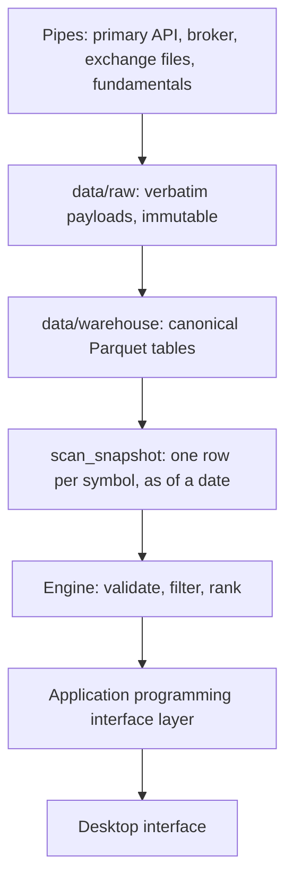

# Architecture

## Principles

1. **Python computes, the browser presents.** No metric, filter, rank or
   aggregate is ever computed in the browser.
2. **Fetching and computing are separate modules.** A bad metric is recomputed
   without re-fetching. A bad fetch never looks like a bad metric.
3. **Raw is raw.** Payloads land on disk exactly as received. Renaming happens
   once, on the way into the canonical warehouse.
4. **One canonical shape, many pipes.** A close is a close. Which pipe filled it
   is a tag on the row, not a different table.
5. **Every fact carries `source` and `as_of`.** Two pipes may disagree without
   silently mixing.

## Layers



### `data/raw/`

Verbatim payloads, partitioned by pipe and fetch date. Never mutated, never
deleted. Field names stay as the upstream sent them, because a raw store that
has been helpfully transformed can no longer tell you what actually arrived.

### `data/warehouse/`

Canonical Parquet tables with Woong's own column names and generic source tags.
This is the local source of truth. Documented in [`DATA.md`](DATA.md).

### `scan_snapshot`

One row per symbol for a given as-of date, holding every metric the engine can
filter or rank on. Scanning a wide, pre-computed table is what keeps the screen
fast and keeps query code simple.

The snapshot is derived. It can always be rebuilt from the warehouse.

### Engine

Validates a query against the metric catalogue, runs the filter, then ranks.
Pure Python over a frame, no network, so it is testable offline.

### Interface layer

One endpoint that accepts a query and returns rows plus counts plus the
plain-English read-back. Serves the single desktop page.

## Repository layout

```
woong/
  config.py         environment reading, the only place secrets are read
  warehouse/        schema, table definitions, snapshot builder
  ingest/           one module per pipe, checkpointed, no computation
  metrics/          metric catalogue and the formulas behind it
  engine/           query validation, filter, rank
  api/              endpoint layer
  web/              one desktop page, no framework
docs/               product, architecture, query, data, contributing
tests/              offline tests, no network
mvp/tasks.json      the current work item
```

## Storage choices

| Choice | Reason |
|---|---|
| Parquet for the warehouse | Columnar, compressed, readable by anything, no server to run. |
| DuckDB for local queries | Reads Parquet directly, no daemon, real SQL. |
| Hosted Postgres later | Only when the interface is served to someone other than the developer. The same canonical tables mirror into it. |
| Plain HTTP for ingest | No vendor client libraries, so no provider name enters the dependency list. |

## Refresh model

| Pipe | Carries | Cadence |
|---|---|---|
| `primary` | Daily closes and returns, factor scores, seasonality, corporate events, institutional flows, market breadth, insider disclosures | Full harvest once, then incremental by watermark |
| `broker` | Official daily close and volume | After each session |
| `exchange` | Index membership | Every harvest, snapshotted so membership history accumulates |
| `fundamentals` | Statement line items | When it exists. Maps into the same tables. |

When two pipes hold the same fact, both rows are stored. The snapshot builder
applies one documented precedence rule, and the interface shows one number.
