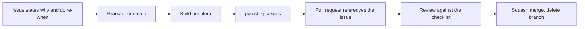

# Contributing

One developer, private repository, professional discipline anyway. The reason is
not ceremony. It is that a reviewed diff against a stated issue is the only way
to catch a wrong number before a user sees it.

## Identity check, before any git operation

```bash
git config user.name    # must be: deevanshuguru
git config user.email   # must be: deevanshu0@gmail.com
```

If either is wrong:

```bash
git config --local user.name "deevanshuguru"
git config --local user.email "deevanshu0@gmail.com"
```

Never commit as any other account.

## The loop



### 1. An issue first

Every change starts from an issue that states:

- **Why**, in terms of the end user.
- **Scope**, as a short list.
- **Done when**, as something observable.

No issue, no branch.

### 2. Branch

```bash
git checkout main && git pull origin main
git checkout -b feat/<short-description>
```

Prefixes: `feat/`, `fix/`, `test/`, `docs/`, `chore/`, `research/`.

Never commit to `main`.

### 3. Commit

Conventional commits. A subject line under 72 characters, then a body that says
what changed and why it is safe.

```
feat(engine): refuse a rank on a metric that is not comparable

Ranking by share price or by a band level derived from it is ranking by
company size wearing a different name. The catalogue already records
comparability, so the engine now blocks it and names the metric.

Refs #4

Co-authored-by: deevanshu-guru <deevanshuguru@gmail.com>
```

Scopes in use: `foundation`, `warehouse`, `ingest`, `metrics`, `engine`, `api`,
`web`, `docs`, `ci`.

Rules:

- `git add` names files explicitly. Never `git add -A`.
- The co-author trailer is required on every commit.
- Never commit `.env`, tokens, `data/` or logs.
- Never attribute work to an assistant or a tool.

### 4. Test before opening anything

```bash
pytest -q
```

A pull request with failing tests is not ready for review.

### 5. Pull request

```bash
git push -u origin feat/<short-description>
gh pr create --title "feat: <what changed>" --body "..."
```

The body must contain: what changed, why, how it was verified, and
`Closes #<issue>`.

### 6. Review before merge

Every pull request is reviewed against the checklist below, and the review is
recorded as a comment on the pull request. Self-review is still review: the
point is that the checklist gets applied, in writing, before merge.

```bash
gh pr merge <number> --squash --delete-branch
```

## Review checklist

**The five rules**

- [ ] No buy, sell, hold, target or "top pick" language anywhere, including
      comments and test names.
- [ ] No estimated, approximated or proxy number. Anything not computable to its
      real definition is switched off with a stored reason.
- [ ] No upstream provider name in code, comments, documentation, schema,
      fixtures, logs or interface copy.
- [ ] No metric computed in the browser.
- [ ] Filter and rank remain separate.

**Data honesty**

- [ ] Every new fact column carries `source` and `as_of`.
- [ ] A missing value cannot pass a filter, and is counted separately from a
      failure.
- [ ] New reference data is downloaded or derived, never typed.

**Engineering**

- [ ] Fetching and computing are not mixed in one module.
- [ ] Errors are raised. Nothing returns an empty result on failure.
- [ ] New checks can fail the run, not only print.
- [ ] Ingest changes remain checkpointed and idempotent.
- [ ] Pure logic is testable without a network.
- [ ] Module docstrings state what the module refuses to do.
- [ ] Comments explain constraints, not the obvious.

**Hygiene**

- [ ] `pytest -q` passes.
- [ ] No secret, token, data file or log is in the diff.
- [ ] The issue is referenced and `STATUS.md` or `mvp/tasks.json` is updated if a
      decision changed.

## Continuous integration

Every push and pull request runs the test suite plus two guard checks:

1. **Provider name guard.** Fails if a known provider name appears anywhere in
   the tracked tree.
2. **Recommendation language guard.** Fails on advice words in interface copy.

Both guards live in `tests/` so they run locally too. The forbidden word lists
are supplied to continuous integration as configuration, never committed as a
list of provider names in the repository.
