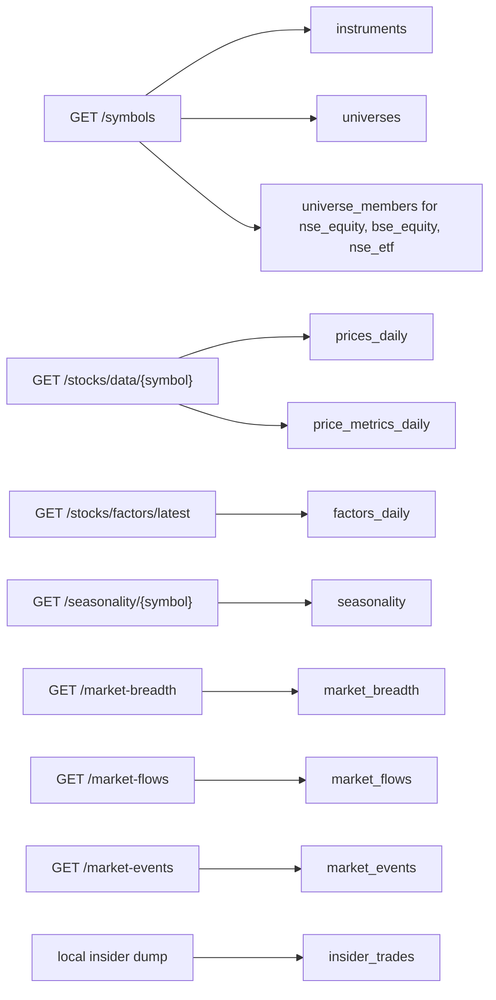

# Data

## Source tags

Only these five values ever appear in a `source` column. No provider name is
recorded anywhere.

| Tag | Meaning |
|---|---|
| `primary` | The primary market data application programming interface (API) |
| `broker` | The broker connection, used for the official daily close |
| `exchange` | Published exchange files, used for index membership |
| `fundamentals` | The fundamentals feed |
| `manual` | Hand-entered and hand-verified |

## Coverage

The harvest covers the **full symbol master and every index**. Not a small index
slice.

Rows may be null. A symbol listed last month has no three-year return, and that
is correct. What is not acceptable is a symbol missing because ingest never
asked for it, because nothing downstream can tell those two cases apart.

## What one instrument is

`instrument_kind` is exactly one of `stock`, `etf`, or `index`.

The primary application programming interface (API) master uses six type
strings. They map as follows, and no other type is accepted:

| Feed `type` | `instrument_kind` | `index_class` | Why |
|---|---|---|---|
| `stock` | `stock` | empty | Listed equity. Has an International Securities Identification Number (ISIN). |
| `etf` | `etf` | empty | An exchange-traded fund (ETF). Has an ISIN. It is not a company. |
| `market` | `index` | `market` | A published market index, for example a 50-stock headline index. No ISIN. |
| `sector` | `index` | `sector` | A published sector index. No ISIN. |
| `thematic` | `index` | `thematic` | A published theme index. No ISIN. |
| `strategy` | `index` | `strategy` | A published factor or strategy index. No ISIN. |

`index_class` exists so we do not lose the feed's split, and so we do not
pretend a factor index is the same object as Nifty 50.

The natural key is `(symbol, exchange)`, not the ticker alone. Seven tickers
appear on both the National Stock Exchange (NSE) and the Bombay Stock Exchange
(BSE) as different companies. A price series that does not name the listing is
not attached to either row.

Picture URLs on the master are dropped. They are not facts.

## Endpoint to table



`/stocks/data/{symbol}` returns a daily close and supplied returns for a
`stock` or an `etf`. It returns HTTP 404 for an `index`. Index daily closes are
not on this path.

The engine does not scan those supplied returns. `scan_snapshot` recomputes
close-to-close returns and the 200-Day Simple Moving Average (200 DMA) from
`prices_daily.close`. A series that is shorter than the lookback is a null,
reported as "had no value".

Unauthenticated calls cannot ask for open, high, low, or volume. Those columns
exist on `prices_daily` and stay null until a token is present.

There is no membership list on the paths we have. `universe_members` for an
index stays empty. `nse_equity`, `bse_equity`, and `nse_etf` are filled from
the master, because those universes are "every row of that kind on that
exchange", not a published constituent file.

The insider dump is copied from disk. The harvest never requests that HTTP path.

## Canonical tables

### Reference

| Table | Grain | Notes |
|---|---|---|
| `instruments` | symbol, exchange | Kind is stock, etf, or index. ISIN is required for stock and etf in the current master, and null for every index. |
| `universes` | universe identifier | `nse_equity`, `bse_equity`, `nse_etf`, plus one empty-membership row per index. |
| `universe_members` | universe, symbol, exchange, as-of | Filled for the three all-kind universes. Empty for each index until a constituent file exists. |

### Market

| Table | Grain | Notes |
|---|---|---|
| `prices_daily` | symbol, exchange, date, source | Session bar. Broker rows carry open, high, low, close and volume on the continuous adjusted series. Primary rows may still have null open/high/low/volume. |
| `broker_instruments` | symbol, exchange | Opaque broker token for each cash listing we care about. Built from the broker instrument dump matched to the warehouse master. |
| `price_metrics_daily` | symbol, exchange, date | Returns as supplied with the close. Stored as received. The engine uses returns computed in the snapshot, not this table. |
| `factors_daily` | symbol, date, source | Four scores as supplied. Labelled as supplied. |
| `seasonality` | symbol, month | Monthly return distribution plus the sample window. Works for index symbols. |
| `market_breadth` | symbol, date | One snapshot date in the current payload. `constituent_count` is a count, not a member list. |
| `market_flows` | date, frequency | Domestic and foreign institutional purchase, disposal, and net. Daily, monthly, yearly. |
| `market_events` | event_id | Parsed fields plus the payload with picture URLs removed. |
| `insider_trades` | disclosure_id | One hash per distinct disclosure row. Person, quantities, holdings, dates. |

### Fundamentals

Line-item grain on purpose. Any future feed maps into the same two tables
without a second data model.

| Table | Grain |
|---|---|
| `fundamentals_annual` | symbol, financial year, line item |
| `fundamentals_quarterly` | symbol, period end, line item |
| `ratios_asof` | symbol, as-of |

`ratios_asof` holds only ratios computed from stored line items, or supplied by
a source with a stated definition. It stays empty, and the matching metrics stay
switched off, until that pipe exists.

### Engine and product

| Table | Purpose |
|---|---|
| `metric_catalog` | One row per metric: definition, formula, source table, comparability, direction, on or off, and the reason when off |
| `scan_snapshot` | Wide table, one row per symbol per as-of date. What the engine actually scans |
| `studies` | A named author's query, with a one-line statement of the idea |
| `scan_runs` | Every execution: the query, the as-of date, how many passed, how many had no value |
| `ingest_jobs` | One row per pipe and endpoint: watermark, cursor, status, last error |

### Reserved

`weight_runs`, `backtest_runs` and `deploy_orders` are created empty. They make
the product path visible in the schema and stop the scanner from hardening into
the only thing the shape supports.

## Refresh

| Pipe | Cadence | Notes |
|---|---|---|
| `primary` | Full harvest once, then incremental by watermark | Checkpointed per symbol |
| `broker` | Full-history backfill once, then after each session | Official continuous adjusted OHLCV. Takes precedence in the snapshot |
| `exchange` | Every harvest | Index membership, snapshotted |
| `fundamentals` | When it exists | Into the same line-item tables |

### Precedence in the snapshot

When more than one pipe holds the same fact for the same symbol and date:

1. `broker` close, because it is the official session close.
2. `primary` close.
3. Anything else, in the order documented in the snapshot builder.

Both rows stay in `prices_daily`. Precedence is applied when the snapshot is
built, never by deleting data.

## Ingest rules

1. Write raw before parsing. A parse bug must not cost a re-fetch.
2. Checkpoint after every symbol or page into `ingest_jobs`.
3. A crash resumes from the checkpoint. It never restarts the harvest.
4. Upserts are idempotent. A second run adds nothing.
5. Rate limit and bound retries. A provider is not a load test target.
6. Failures are collected, printed and returned as a non-zero exit code. A run
   that half-worked must not look like a run that worked.
7. Never author reference data. Download it or derive it. Do not type it.

## Broker daily bars

The broker pipe stores one row per session in `prices_daily` with `source =
broker`. The series is the broker's continuous adjusted open, high, low, close
and volume. Long-horizon returns and month returns are computed from that
series so a split does not invent a crash.

Commands:

```text
python -m woong.ingest.broker_auth --check
python -m woong.ingest.broker harvest-instruments
python -m woong.ingest.broker harvest-ohlcv
python -m woong.ingest.broker harvest-all
```

Connection details live in `.env` only. Headless login writes
`data/.broker_token` (gitignored, mode 0600). The connect step uses the login
host, not the market-data host. An env access token skips file and login.
Tokens are invalid after the broker's daily reset at 06:00 India Standard Time
(IST). The evening incremental job is a later part: this slice is the one-time
full-history backfill.
