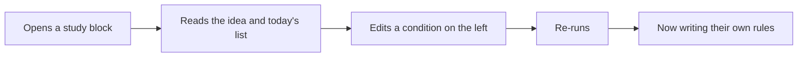

# Product

## Who this is for

A swing trader or short-term investor in Indian equities who already does
analysis, usually in a spreadsheet or across three or four websites.

They are not a beginner. They already know Price to Earnings (P/E), the 200-Day
Moving Average (200 DMA) and 52-week highs.

## The problem

Not a shortage of filters. Every screener has hundreds.

The real problem has two halves:

1. **They do not know which question to ask next.** Their toolkit is a handful
   of common metrics, so their analysis stays at the level of those metrics.
2. **Tools bombard them.** A blank screen with eighty knobs is not power, it is
   paralysis. The work of turning knobs into a question is left to the user.

## What Woong does about it

Woong is an engine plus a small number of study blocks.

**The engine** takes a universe, filters it, and ranks what survives. Anything
legal in the metric catalogue can be asked.

**A study block** is a named person's rule, already written and already run, with
the resulting list on screen and a one-line statement of the idea behind it.

The path a user takes:



They are never dropped onto a blank metric list. They learn the tool by changing
something that already works.

## Ship a few blocks, not thirty

Three blocks at launch. Each one teaches a different idea, and each one is a
question rather than a tip.

Adding a fourth requires a reason. A long list of blocks is the same bombardment
problem wearing different clothes.

## Better questions over time

Common metrics stay available. They are the vocabulary a user arrives with, and
removing them would be arrogant.

Beyond them, Woong adds metrics that most retail tools do not carry. The route
in is deliberately slow:

1. The idea is written down in [`metric-ideas.md`](metric-ideas.md), with where
   it came from and what it claims.
2. It becomes a row in the metric catalogue with a written definition and a real
   formula over warehouse columns.
3. It gets tests.
4. Only then, maybe, it becomes a study block.

A metric never appears as a surprise column. A metric with no real formula is
switched off, with the reason shown.

## The first screen

Desktop, light mode. No mobile layout, no charts, no visual polish pass.
Operations on the left, results on the right.

```
+---------------------------+----------------------------------------+
| STUDIES                   |  142 passed    8 had no value          |
|  - three named blocks     |                                        |
|                           |  Symbol  Name      Fall %   Rank       |
| UNIVERSE                  |  ...................................   |
|  all equity / an index    |  ...................................   |
|  / a sector / custom      |  ...................................   |
|                           |                                        |
| CONDITIONS                |  "Fall from 52-week high above 15%,    |
|  metric  op  value   [x]  |   ranked by that fall, top 30."        |
|  and/or                   |                                        |
|  [+ condition]            |  This is a filter and rank result.     |
|                           |  Not a buy or sell recommendation.     |
| RANKING                   |                                        |
|  metric, direction, top N |                                        |
+---------------------------+----------------------------------------+
```

What the right side always shows:

- The count that passed, and separately the count that had no value. A stock we
  could not measure is not a stock that failed.
- The columns the rule actually used, so the result can be checked by eye.
- The rule in one plain-English sentence.
- The line: "This is a filter and rank result. Not a buy or sell
  recommendation."

## Deliberately later

| Later | Why not now |
|---|---|
| Natural language queries | The structured screen has to work first. Both compile to the same query object, so this is additive. |
| Performance history on a study | Requires an honest backtest. A fake performance number would break the data-honesty rule. |
| Weighting interface | The schema reserves it. The user has to understand filter against rank first. |
| Broker deployment | Execution is a different product with different obligations. |
| Accounts, mobile, dark mode, polish | None of these make the first list correct. |
